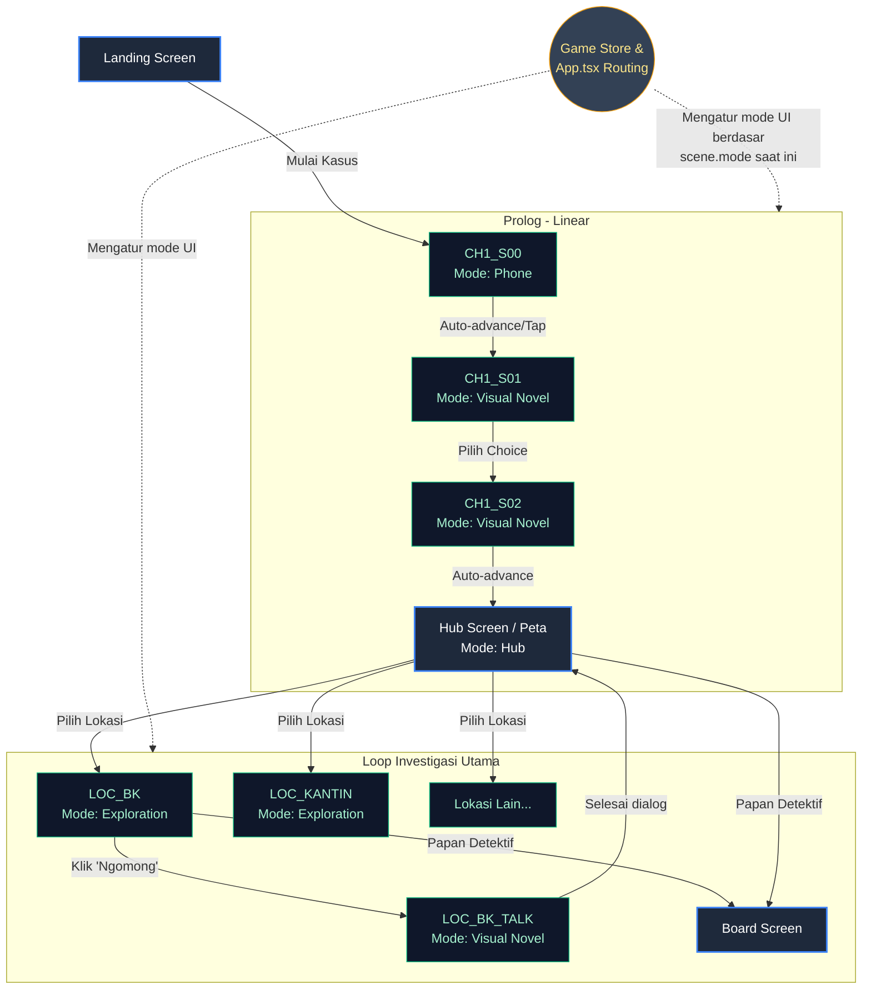

# Game Flow & Arsitektur Navigasi "Sebelum Viral"

Game ini menggunakan sistem **Scene-Based Routing** yang dikendalikan oleh file terpusat (`App.tsx` & `gameStore.ts`). Setiap "Scene" tidak hanya berisi cerita, tetapi juga mendikte **Mode UI** apa yang harus ditampilkan di layar. 

Berikut adalah penjelasan berurutan bagaimana pemain mengalami game ini dari awal hingga masuk ke mode penyelidikan utama.

---

## 1. Alur Linear Awal (Prolog)
Di awal permainan, pemain dipaksa mengikuti alur cerita linear untuk membangun ketegangan.
1. **Landing Screen**: Layar judul utama. Klik "Mulai Kasus".
2. **Phone Scene (`CH1_S00`)**: Layar berubah menjadi antarmuka *smartphone*. Hoaks pertama pecah di Twitter/Menfess. Pemain hanya bisa *tap* layar untuk melihat komentar netizen yang bergulir cepat.
3. **Visual Novel Scene (`CH1_S01` & `CH1_S02`)**: Setelah keluar dari HP, game beralih ke mode *Visual Novel* konvensional. Nala bertemu Aldi di UKS, melihat Aldi terkena *panic attack*, dan Nala berjanji untuk menyelidiki kasus ini.

## 2. Masuk ke Loop Gameplay Utama (Act 2)
Setelah prolog selesai, game melepaskan kendali linear dan masuk ke sistem **Hub & Eksplorasi**.
1. **Hub Screen (`CH1_HUB`)**: Layar navigasi utama (Peta Sekolah). Di sini Nala bisa memilih untuk pergi ke berbagai lokasi: Kantin, Ruang UKS, Ruang BK, Lapangan, dll.
2. **Exploration Mode (`LOC_...`)**: Saat Nala tiba di suatu lokasi (misal: Ruang BK), antarmuka berubah menjadi ala *Ace Attorney*. Akan ada tampilan background, sprite karakter di lokasi tersebut (misal: Bu Salma), dan **4 Tombol Aksi**:
   - 💬 **Ngomong**: Masuk ke obrolan biasa (membuka *Visual Novel Scene* kecil).
   - 🔍 **Investigasi**: Memeriksa barang/area di latar belakang (belum diimplementasi penuh).
   - ❓ **Interogasi**: Menekan karakter mengenai topik spesifik/bukti (jika sudah terbuka).
   - ⚔️ **Konfrontasi**: Menyerang argumen mereka dengan bukti (klimaks).
3. **Papan Detektif & Inventory**: Kapan saja saat berada di Hub atau Exploration, pemain bisa membuka Inventory (HP Nala) atau Papan Detektif untuk merangkai petunjuk.

---

## 3. Diagram Alur Navigasi UI

Berikut adalah gambaran teknis bagaimana *State Machine* game berpindah antar layar:

---

## 4. Mekanik Game yang Belum Diimplementasikan
Berdasarkan dokumen `revisi-cerita.md` dan *Game Design Document*, berikut adalah mekanik yang belum kita bangun (dan akan menjadi fokus selanjutnya):

1. **Sistem Waktu (Ticker)**:
   - Setiap tindakan Nala (pindah lokasi, interogasi panjang, salah menuduh) memakan *waktu* (TickerDelta).
   - Seiring waktu berlalu, **Hoaks Gelombang Baru (Hoax Waves)** akan otomatis ter-trigger, mengubah situasi di sekolah dan menurunkan skor *Reputation* Aldi jika dibiarkan.
2. **Papan Detektif Dinamis (Evidence Board)**:
   - UI *Board* saat ini hanya purwarupa. Kita harus membuat pemain bisa "menghubungkan" dua bukti dengan garis merah untuk membuka *Insight* baru.
3. **Konfrontasi (Cross-Examination)**:
   - Tombol "Konfrontasi" di layar Eksplorasi belum berfungsi. Saat pemain mengumpulkan cukup bukti, mereka harus bisa masuk ke mode adu argumen (menembak titik lemah kebohongan dengan bukti yang tepat).
4. **Mini-game Investigasi Layar**:
   - Tombol "Investigasi" nantinya akan memungkinkan pemain men-*tap* area spesifik di *background* untuk menemukan petunjuk (misal: mengecek PC yang menyala di Ruang BK).

Bagaimana? Apakah penjelasan *flow* dan *roadmap* kita di atas sudah cukup jelas sebelum kita lanjut mengimplementasikan fitur selanjutnya?
